# Documentación del método `procesarImportacion`

Este documento es un diagrama de flujo explicando el funcionamiento del método `procesarImportacion` del controlador `ImportacionBussinesRestController`.

---

```mermaid
graph TD
    Start([🎯 Inicio Usuario envía archivo Excel + imarcId]) --> ValidProcess{¿Hay proceso<br/>activo?}
    
    ValidProcess -->|Sí| ErrorProcess[❌ Error: Proceso activo]
    ValidProcess -->|No| LoadConfig[Cargar configuración IMARC<br/>con IMCOL e IMINS]
    
    LoadConfig --> InitSpreadsheet[Crear SpreadsheetUtil<br/>para leer Excel]
    
    InitSpreadsheet --> ValidColumns{¿Columnas<br/>válidas?}
    ValidColumns -->|No| ErrorColumns[❌ Error: Columnas faltantes]
    ValidColumns -->|Sí| ValidTypes{¿Tipos de datos<br/>válidos?}
    
    ValidTypes -->|No| ErrorTypes[❌ Error: Tipos incorrectos]
    ValidTypes -->|Sí| CleanTemp[Limpiar tabla temporal<br/>IMCDSUS del usuario]
    
    CleanTemp --> UploadRecords[uploadRecords<br/>Cargar Excel → IMCDSUS]
    
    UploadRecords --> EnrichData[obtenerRegistrosBaseCentralByDsusPcodigo<br/>JOIN con tablas maestras]
    
    EnrichData --> InitProcess[INICIAR PROCESAMIENTO<br/>iniciarProcesamiento]
    
    InitProcess --> CountRecords{Contar registros<br/>ImcdGlobal.size}
    
    CountRecords --> Strategy{Determinar estrategia}
    
    Strategy -->|≤100| S1[👤1 hilo<br/>Todos los registros]
    Strategy -->|≤500| S2[👥 4 hilos<br/>~125 reg/hilo]
    Strategy -->|≤2000| S3[👥👥 8 hilos<br/>~250 reg/hilo]
    Strategy -->|>2000| S4[👥👥👥14 hilos<br/>~150 reg/hilo]
    
    S1 --> CreatePool
    S2 --> CreatePool
    S3 --> CreatePool
    S4 --> CreatePool
    
    CreatePool[Crear ExecutorService<br/>con N hilos] --> CreateSyncList[Crear lista sincronizada<br/>allProyecciones]
    
    CreateSyncList --> DivideWork[ DIVIDIR TRABAJO ]
    
    DivideWork --> ForLoop{For i=0; i &lt; registros; i+=tamGrupo<br/>}
      ForLoop -->|Inicio Proceso Lotes| CreateBatch[Crear sublista<br/>subImcdGlobal&#91;inicio:fin&#93;]
    CreateBatch --> CreateTask[Crear ImportacionControlService<br/>con parámetros del lote]
    CreateTask --> SubmitTask[executor.submit<br/>Enviar al pool de threads]
    SubmitTask --> AddFuture[Agregar Future<br/>a lista de futures]
    AddFuture --> ForLoop
    
    ForLoop -->|Todos los lotes enviados| WaitResults[ ESPERAR RESULTADOS ]
    
    WaitResults --> ForFutures{For cada Future}
    
    ForFutures -->|Siguiente| WaitFuture[future.get<br/>Timeout: 10 min]
    
    WaitFuture -->|Éxito| SuccessCount[lotesProcesados++]
    WaitFuture -->|Timeout| TimeoutError[Crear mensaje error<br/>Cancel thread]
    WaitFuture -->|Exception| ExceptionError[Crear mensaje error]
    
    SuccessCount --> ForFutures
    TimeoutError --> ForFutures
    ExceptionError --> ForFutures
    
    ForFutures -->|Todos procesados| ProcessResults[Procesar allProyecciones]
    
    ProcessResults --> FilterValid[Filtrar proyecciones válidas<br/>sin errores]
    
    FilterValid --> SavePimp[Guardar PimpProcesoImportacion<br/>con proyecciones]
    
    SavePimp --> ReturnResult([Retornar resultado<br/>con información y errores])
    
    subgraph ThreadExecution[" "]
        direction TB
        T1[Thread recibe lote] --> T2[resolverGrupo]
        T2 --> T3[Obtener datos Excel<br/>getDataMatrix]
        T3 --> T4[For cada fila del lote]
        T4 --> T5[Aplicar transformaciones<br/>ResolucionUtil]
        T5 --> T6[resolucionInsertsOneDirection]
        T6 --> T7[For cada IMINS ordenado]
        T7 --> T8{¿Tiene<br/>dependencias?}
        T8 -->|Sí| T9[onOneDirection<br/>Usar valores anteriores]
        T8 -->|No| T10[buildProyeccion<br/>INSERT simple]
        T9 --> T11[Generar SQL UPSERT]
        T10 --> T11
        T11 --> T12[Guardar valores RETURNING<br/>en memoryData]
        T12 --> T13[Crear PiminsProyeccionImins<br/>con JSON de SQLs]
        T13 --> T14[Agregar a lista sincronizada<br/>allProyecciones.add]
    end
    
    SubmitTask -.->|Ejecuta en paralelo| ThreadExecution
    
    subgraph SQLGeneration[" "]
        direction LR
        SQL1[Columnas y valores] --> SQL2[INSERT INTO tabla]
        SQL2 --> SQL3[ON CONFLICT columnas]
        SQL3 --> SQL4[DO UPDATE SET]
        SQL4 --> SQL5[RETURNING campos]
    end
    
    T11 -.-> SQLGeneration
    
    style InitProcess fill:#ff9999
    style DivideWork fill:#99ccff
    style WaitResults fill:#99ff99
    style ThreadExecution fill:#ffffcc
    style SQLGeneration fill:#ffccff
    
```
